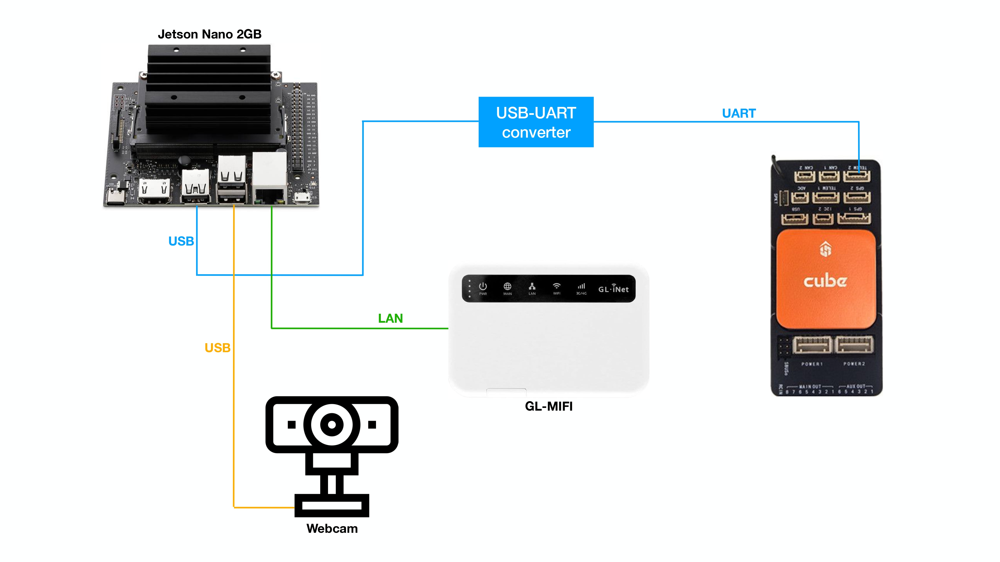
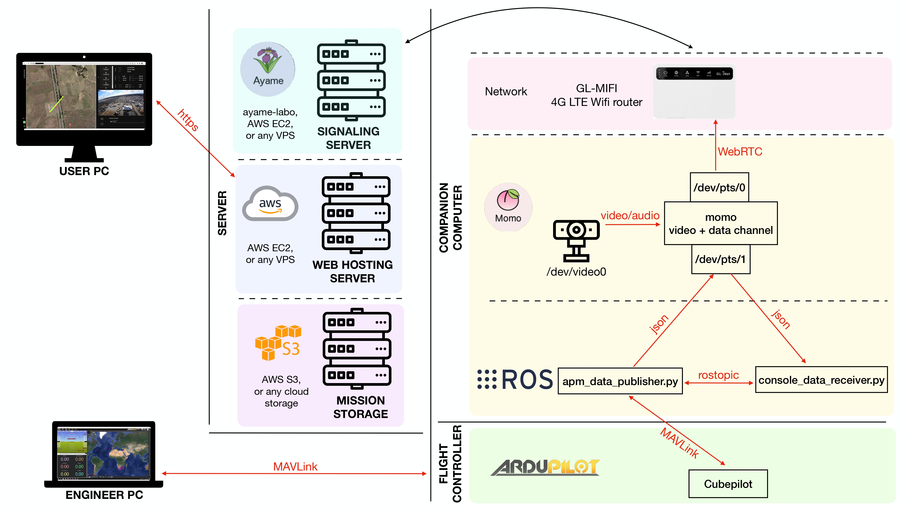

# Ardupilot drone control by WebRTC and ROS

The purpose of this project is to create a simple ground control system (GCS) for non-engineer user whose can easily operate the drone by pressing flight mode button and selecting the pre-defined mission from drone engineer. It is just "Proof-of-Concept" or POC project, not for commercial.

This project is consisted of two repositories,

1. Back-end (this repo) which takes care of the communication in low-level with Cubepilot by MAVLink, and also in high-level to parse data from user GCS or to send telemetry data back to user GCS.

2. Front-end from [Cielo Jordan's repo](https://github.com/cielojordan) which takes care of communication from signaling server, displaying the parse data to user GCS, and pack the user's command to send back to robot. And also a design of user interface.

## Hardware

- A completed setup of drone with basic peripheral, pleas check on Ardupilot documentation [here](https://ardupilot.org/copter/docs/initial-setup.html).

- A companion computer, in this case I am using Jetson Nano 2GB

- USB-UART converter, I am using [this](https://digilent.com/reference/pmod/pmodusbuart/start).

- 4G LTE router (with sim card) to allow Jetson nano to have internet access.

- USB webcam



## Concept

We are using Jetson nano as a companion computer to send/receive data to Cubepilot on the drone, the communication between these two computers is MAVLink on TELEM2 port. 

The [Dronekit python API](https://dronekit-python.readthedocs.io/en/latest/about/index.html) can help parsing/constructig MAVLink data which we can easily grab and use it on higher level, and also send command back to Ardupilot.

Please look at the diagram below, and follow along with the explanation.



### momo

Momo is the WebRTC opensource project which can stream video camera to any web application, and along side with message that allow user to interact with robot's computer.

Please check more detail of this project on following links

https://momo.shiguredo.jp/

https://github.com/shiguredo/momo

And in order to send data/video over the internet, you will need to setup Ayame as a signaling server, the original developer of momo provides this server to use for free, please check on the link below,

https://ayame-labo.shiguredo.jp/

https://github.com/OpenAyame/ayame

You can download the binary from their [release page](https://github.com/shiguredo/momo/releases). 

Next step is to create the pseudo serial ports, and run momo with the command below,

```sh
## to create /dev/pts/* ports pair,
socat -t 0 -d -d pty,raw,echo=0 pty,raw,echo=0 

## on Jetson Nano
./momo --hw-mjpeg-decoder 0 --no-audio-device --video-device /dev/video0 --resolution 1920x1080 --serial {1st_port},9600 ayame --signaling-url wss://ayame-labo.shiguredo.jp/signaling --channel-id {your_channel_id} --signaling-key {your_signaling_key} 

```

The output of above `socat` command could be something like,

```
rasheed@rasheed-x17:~/Desktop$ socat -t 0 -d -d pty,raw,echo=0 pty,raw,echo=0 
2022/04/06 23:17:51 socat[18764] N PTY is /dev/pts/0
2022/04/06 23:17:51 socat[18764] N PTY is /dev/pts/1
2022/04/06 23:17:51 socat[18764] N starting data transfer loop with FDs [5,5] and [7,7]

```

so you will need to change 

- `--serial {1st_port}` to whatever the first port is showing, in this case it's `/dev/pts/0`. So it depends on how many terminal you're openning right now. If this `socat` command is running in the background by autostart or systemd with no terminal openning, the first port would be `/dev/pts/0` all the time. 

- `--channel-id {your_channel_id}` the room id to let the communication happens in correct place.

- `--signaling-key {your_signaling_key}` to the key of your signaling server configuration.

If there is no error, and signaling server is running, you can check on the url that hosting your web application. Please check more detail of this on [Cielo Jordan's repo](https://github.com/cielojordan).

The data from buttons, or any user input from the web console will arrive at the Jetson nano on `/dev/pts/1` port, to simply check we can run `cat /dev/pts/1` to see data from user. At the same time, we would like to push some data to the web console, we need to echo the data to this `/dev/pts/1` port, for example `echo hello > /dev/pts/1`. This will be sending a string text as "hello" to web console.

To make it as our standard, we are using json format with the key name that reflect the meaning of data we would like to send. And below is the telemetry data from Ardupilot that would be sent to web console.

`{"telemetry": {"pos": {"lat": -35.3622223, "lon": 149.1666235, "alt": 100.0}, "att": {"roll": -0.01, "pitch": 0.02, "yaw": -71.94}, "dist": {"travelled": 8698.3, "toHome": 170.79, "toNextWp": 0.34}, "speed": {"air": 0.0, "ground": 0.02}, "nav": {"nextWp": 8, "eta": ["Passed", "Passed", "Passed", "Passed", "Passed", "Passed", "Passed", "Passed"]}, "mode": "AUTO", "gps": "RTKFXD", "batt": {"volt": 12.59, "current": 28.16}}, "id": 1}`

and from user console, the Jetson will get

`{"cmd": {"mode" MAN}, "mission": "mission1.txt", "id": 1}`

Currently, we allow user to just change the flight mode as Loiter, RTL or Auto, and send which mission to run in auto mode.


### apm_data_publisher node

The `apm_data_publisher.py` is a python script which connecting to Ardupilot by Dronekit API, and listening to necessaries telemetry data. Once the telemetry data arrived, it would be packed as python dictionary object with the proper keys value,

```
telem_dict = {
    "telemetry": {
        "pos": {"lat": lat, "lon": lon, "alt": alt_rel},
        "att": {"roll": roll, "pitch": pitch, "yaw": yaw},
        "dist": {"travelled": travelled, "toHome": tohome, "toNextWp": 0.0},
        "speed": {"air": airspeed, "ground": groundspeed},
        "nav": {"nextWp": 0, "eta":[]},
        "mode": "MAN",
        "gps": "",
        "batt": {"volt": volt, "current": current}},
    "id": _id	
    }
```

This `telem_dict` would be dumped as json format and written to the text file called `console_telemetry.txt` and stored at the root directory of the project.

At the end of the while loop, the data on this file will be pushed to pseudo serial port at `/dev/pts/1` as created by `socat` command before.

```
cmd1 = 'echo $(cat console_telemetry.txt) > {:s}'.format(CONSOLE_PORT)
subprocess.call(cmd1, shell=True)               # for python2
# subprocess.run(cmd1, shell=True, check=True)  # for python3
```

### console_data_receiver node

This `console_data_receiver.py` is a python script to read the incoming data on `/dev/pts/1` port from user web console. As described earlier that user command data will be json format as 

`{"cmd": {"mode" MAN}, "mission": "mission1.txt", "id": 1}`

so this json data is loaded, and spliited to ros `ConsoleCmd` message, then publish as ros topic called `/console_cmd` 

The `ConsoleCmd` message is ROS custom message from `webrtc_telemetry` package made by me, so please clone this [webrtc_telemetry package](https://github.com/rasheeddo/webrtc_telemetry) to your catkin_ws and build before.


`apm_data_publisher.py` node is subscribing on this `/console_cmd` topic to get data of flight mode and mission file.


## Dependencies and Setup

### Jetson Nano

- `sudo apt-get install socat`

- `sudo pip install dronekit`

- Download momo binary from [here](https://github.com/shiguredo/momo/releases).

- install ROS melodic from [here](http://wiki.ros.org/melodic/Installation/Ubuntu), and create catkin_ws environment.

- clone [webrtc_telemetry package](https://github.com/rasheeddo/webrtc_telemetry) to catkin_ws and build

### Cubepilot Orange

Connect Mission Planner to the cube, and setup the parameters below

```
Set unused uart protocol to None
SERIAL3_PROTOCOL = -1
SERIAL4_PROTOCOL = -1
SERIAL5_PROTOCOL = -1

otherwise there would be some error when connecting with dronekit
https://github.com/dronekit/dronekit-python/issues/1024

Set serial2 for Jetson nano connection
SERIAL2_PROTOCOL = 1
SERIAL2_BAUD = 921
```
## Run

```sh
# Terminal1
# Create pseudo serial port by socat
sh 1st_socat.sh
# Check what is the output of socat, mark it as 1st_port and 2nd_port
# It should be a pair like, /dev/pts/0 /dev/pts1, or /dev/pts/1 /dev/pts2, or so on.

# Terminal2
# Change directory to momo
./momo --hw-mjpeg-decoder 0 --no-audio-device --video-device /dev/video0 --resolution 1920x1080 --serial {1st_port},9600 ayame --signaling-url wss://ayame-labo.shiguredo.jp/signaling --channel-id {your_channel_id} --signaling-key {your_signaling_key} 
# Change {1st_port}, {your_channel_id}, and {your_signaling_key} to yours as explained above

# Terminal3
# Run roscore
source /opt/ros/melodic/setup.bash
source ~/catkin_ws/devel/setup.bash
roscore

# Terminal4
source /opt/ros/melodic/setup.bash
source ~/catkin_ws/devel/setup.bash
python console_data_receiver.py --console_port {2nd_port}
# Change {2nd_port} according to the 2nd port from socat

# Terminal5
source /opt/ros/melodic/setup.bash
source ~/catkin_ws/devel/setup.bash
python apm_data_publisher.py --console_port {2nd_port} --serial /dev/ttyUSB0:921600 --id 1 --s3 {mission_bucket}
# Change {2nd_port} according to the 2nd port from socat
# Change {mission_bucket} to where you store the mission file on S3 bucket,
# note that the Jetson nano should have credential key to access S3
# For testing we can use Ardupilot SITL instead, 
# so specify --udp localhost:14550 instead of --serial
```
